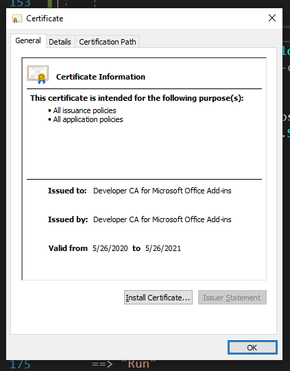

# Spawn
> Swate - something or someone that gets you absolutely joyed (Urban dictionary)

__Spawn__ is a **S**wate **P**rotocol **A**rchitect for **W**ord **N**otes.

Spawn tries to make the transfer of old Word protocols into modern workflow annotations as easy and fast as possible. We will design this process to be perfectly integrable with [Swate](https://github.com/nfdi4plants/Swate) and [Arc](https://github.com/nfdi4plants/ARC).

## Install/Use

You can test Spawn by following the steps below. If you decide to do so, please take the time to set up a Github account to report your issues and suggestions [here](https://github.com/nfdi4plants/Spawn/issues).
You can also search existing issues for solutions for your questions and/or discussions about your suggestions.

### Word desktop (WIP)

#### Using the release archive

- Install [node.js LTS](https://nodejs.org/en/) (needed for office addin related tooling)
- Download the [latest test release archive]() and extract it
- Execute the test.cmd (windows, as administrator) or test.sh (macOS, you will need to make it executable via chmod a+x) script.

#### Using a shared folder 

If you have administrative access in your organization, you can create a network share folder and follow [this guide](https://github.com/OfficeDev/office-js-docs-pr/blob/master/docs/testing/create-a-network-shared-folder-catalog-for-task-pane-and-content-add-ins.md#:~:text=Sideload%20your%20add%2Din,-Put%20the%20manifest&text=Be%20sure%20to%20specify%20the,element%20of%20the%20manifest%20file.&text=In%20Excel%2C%20Word%2C%20or%20PowerPoint,Office%20Add%2Dins%20dialog%20box.) to make the addin available without any further downloads from your users

### Excel online (WIP)

- Download the [latest test release archive]() and extract it
- Launch Excel online, open a (blank) workbook 
- Under the `Insert` tab, select `Add-Ins`
- Go to `Manage my Add-Ins` and select `Upload my Add-In`
- select and upload the `manifest.xml` file contained in the test release archive.

## Discuss/Get help

### Documentation (WIP)

#### API docs

The RPC API docs of Spawn are available [here]().

#### Feature documentation

Documentation of the features is now a top priority as we completed the POC stage :rocket:. You can discuss needed docs and the available ones [here]()

#### Guides

Guides will be coming in the near future.

### Report problems and request features

Please use [Github issues](https://github.com/nfdi4plants/Spawn/issues/new) to track problems, feature requests, questions, and discussions. Additionally, you can get in touch with us on [Twitter](https://twitter.com/nfdi4plants)

### (Beta) Discuss in the GitHub Discussion forum (WIP)

GitHub recently added forum-like features to repositories, which makes it possible to discuss and share things you do with swate without creating issues. You are very welcome to post content [in the `Discussions` tab](), but please use issues for bug reports/feature requests (or, if some of those result from a discussion, create a new issue referencing the discussion)

## Develop

### Contribute

Before you contribute to the project remember to return all placeholders to your project:

-   webpack.config.js    
    ```
    https: {
        key: "{USERFOLDER}/.office-addin-dev-certs/localhost.key",
        cert: "{USERFOLDER}/.office-addin-dev-certs/localhost.crt",
        ca: "{USERFOLDER}/.office-addin-dev-certs/ca.crt"
    },
    ```

### Prerequisites

 - .NET Core SDK at of at least the version in [the global.json file](global.json)
 - Node.js with npm/npx
 - To setup all dev dependencies, you can run the following commands or the install.cmd file (explained further below).

    `dotnet tool restore` (to restore local dotnet tools)

    `dotnet fake build -t setup`, which will take care of installing necessary certificates and loopback exempts for your browser. Here are the steps if you want to execute them by yourself:

    - connections from excel to localhost need to be via https, so you need a certificate and trust it. [office-addin-dev-certs](https://www.npmjs.com/package/office-addin-dev-certs?activeTab=versions) does that for you.

        you can also use the fake build target for certificate creation and installation by using `dotnet fake build -t createdevcerts` in the project root (after restoring tools via `dotnet tool restore`).

        This will use office-addin-dev-certs to create the necessary certificates, and open the installation dialogue for you:

        

        installing this ca certificate under your __trusted root certification authorities__ will enable you to use https via localhost.

        The paths to these certificates are then added to your webpack.config file.

     - You may need a loopback exemption for Edge/IE (whatever is run in your excel version): 

        `CheckNetIsolation LoopbackExempt -a -n="microsoft.win32webviewhost_cw5n1h2txyewy"`

### use install.cmd

The install.cmd executes several console commands for one of which it needs adminstratorial rights (dotnet fake build -t setup) to install the certificate mentioned above.
Open powershell as adminstrator and navigate to the Spawn-folder ```cd your\folder\path\Spawn``` then use ```.\install.cmd``` to initialize the setup.
While running a installation dialogue for the certificate will open and can be handled as described above.

### Project Decription

This project uses the [SAFE Stack](https://github.com/SAFE-Stack) to create a website that uses [office.js](https://github.com/OfficeDev/office-js) to interop with Word.

The file [OfficeJS.fs](src/Client/OfficeJS.fs) contains Fable bindings autogenerated from the office.js typescript definitions.

to debug the AddIn locally, use the build target `OfficeDebug`:

`fake build -t OfficeDebug`

this will launch an Word instance with the add-in sideloaded.
The app runs at localhost:3000 for client and localhost:5000 for the server.

You can use [EdgeDevToolsPreview](https://www.microsoft.com/en-us/p/microsoft-edge-devtools-preview/9mzbfrmz0mnj?activetab=pivot:overviewtab) for debugging the browser add-in (console, html) _or_ you can use Word online for development:

 - open Word online in your favorite browser
 - create a blank new workbook (or use any workbook, but be warned that you can't undo stuff done via Office.js) 
 - Go to Insert > Add-Ins > Upload my Add--Ins and upload the manifest.xml file contained in this repo.
 - You will now have the full debug experience in your browser dev tools.

Alternatively, you can debug all functionality that does not use Excel Interop in your normal browser (the app runs on port 3000 via https)

### Office.js

1. install ts2fable, needs typescript declaration files from office.js
2. donwload office.js and create fs files from it
3. adjust webpack and index.html

Necessary links:
- https://github.com/fable-compiler/ts2fable
- https://www.npmjs.com/package/@microsoft/office-js
- use office ja as external: [Swate/webpack.config.js at developer · nfdi4plants/Swate (github.com)](https://github.com/nfdi4plants/Swate/blob/developer/webpack.config.js#L117)
- [Swate/index.html at developer · nfdi4plants/Swate (github.com)](https://github.com/nfdi4plants/Swate/blob/developer/src/Client/index.html#L5)
